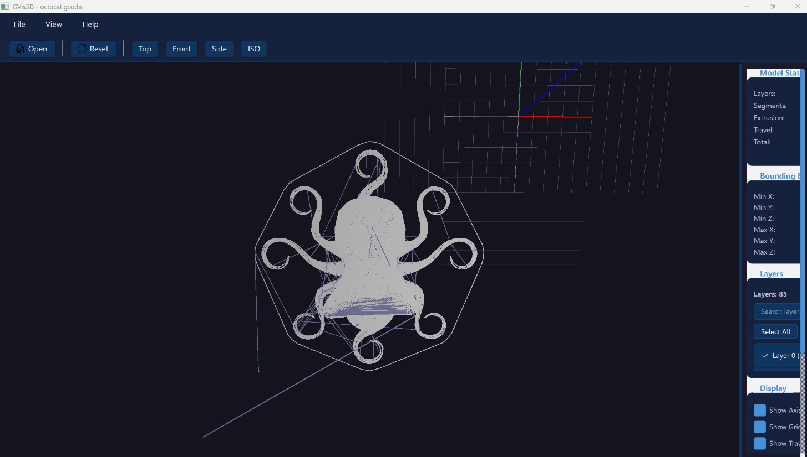

# GVis3D



A desktop 3D viewer for GCode files, built with Python, PySide6, and OpenGL.

## Features

- **3D Visualization**: Render GCode files in 3D with OpenGL
- **Interactive Controls**: Rotate, zoom, and pan with mouse
- **Layer Management**: Toggle visibility of individual layers
- **Model Statistics**: View extrusion distance, travel distance, bounding box, and more
- **Arc Support**: Properly handle G2/G3 arc commands
- **Dark Theme**: Professional dark UI design
- **File Drag & Drop**: Load GCode files by dragging them into the window
- **Asynchronous Loading**: Non-blocking file loading for large files
- **Lighting System**: Multiple light sources with ambient, spot, and point lights
- **Tube Rendering**: 3D tubular geometry for realistic filament visualization
- **Performance Optimization**: Multi-threaded VBO building and vectorized computation

## Installation

### Prerequisites

- Python 3.10 or higher
- pip package manager

### Install Dependencies

```bash
pip install -r requirements.txt
```

Or install manually:

```bash
pip install PySide6 PyOpenGL numpy
```

## Usage

### Run the Application

```bash
python main.py
```

### Open a GCode File

1. Click **File > Open GCode File** or press `Ctrl+O`
2. Select a GCode file (`.gcode`, `.gco`, `.gc`)
3. Or simply drag a GCode file into the window

### Navigation

| Action | Control |
|--------|---------|
| Rotate | Left-click and drag |
| Pan | Right-click and drag |
| Zoom | Mouse scroll wheel |
| Reset View | Press `R` |

### View Presets

| Shortcut | View |
|----------|------|
| `1` | Top |
| `2` | Front |
| `3` | Side |
| `4` | Isometric |

### Display Options

- **Show Axis**: Toggle X/Y/Z axis display
- **Show Grid**: Toggle reference grid display
- **Show Travel Lines**: Toggle non-extrusion movement lines
- **Enable Lighting**: Toggle OpenGL lighting effects
- **Use Tube Rendering**: Toggle between tube and line rendering
- **Ambient Intensity**: Adjust ambient light brightness
- **Spotlight Intensity**: Adjust spotlight brightness
- **Tube Radius**: Adjust tube thickness

## Keyboard Shortcuts

| Shortcut | Action |
|----------|--------|
| `Ctrl+O` | Open file |
| `Ctrl+Q` | Exit |
| `R` | Reset view |
| `1` | Top view |
| `2` | Front view |
| `3` | Side view |
| `4` | Isometric view |

## Supported GCode Commands

| Command | Description |
|---------|-------------|
| `G0` | Rapid move |
| `G1` | Linear move |
| `G2` | Clockwise arc |
| `G3` | Counter-clockwise arc |
| `G20` | Units: inches |
| `G21` | Units: millimeters |
| `G90` | Absolute positioning |
| `G91` | Relative positioning |
| `G92` | Set position |
| `M82` | Absolute extrusion |
| `M83` | Relative extrusion |
| `M84` | Disable motors |

## Project Structure

```
gvis3d/
├── main.py                    # Application entry point
├── requirements.txt           # Dependencies
├── setup.py                   # Packaging configuration
├── DESIGN.md                  # Design documentation
├── README.md                  # This file
├── gcode_viewer/              # Main package
│   ├── __init__.py
│   ├── gcode_parser.py        # GCode lexer/parser
│   ├── gcode_model.py         # Model data structures
│   ├── gl_widget.py           # OpenGL rendering with lighting
│   └── main_window.py         # Main UI window
└── examples/              # Sample GCode files
    └── octocat.gcode          # Default demo file
```

## Technical Details

### Architecture

The application follows a modular architecture:

1. **GCodeParser**: Parses GCode text into structured commands
2. **GCodeModel**: Stores parsed model data (layers, segments, statistics)
3. **GLWidget**: Renders 3D model using OpenGL with lighting and VBO
4. **VBOBuilder**: Background thread for building vertex buffer objects
5. **MainWindow**: Coordinates UI and business logic
6. **GCodeLoader**: Async file loading with progress reporting

### Rendering

- **Lighting**: 5 light sources (1 ambient + 1 spotlight + 3 point lights)
- **Materials**: Configurable ambient, diffuse, and specular properties
- **VBO**: Vertex Buffer Objects for efficient rendering
- **Tube Geometry**: Cylindrical rendering for realistic filament appearance
- **Depth Testing**: Correct 3D rendering with proper occlusion
- **Colors**: White for extrusion, blue for travel

### Performance

- **Multi-threaded**: VBO building runs in background thread
- **Vectorized**: NumPy-based vertex computation
- **Rendering Throttling**: 60fps frame rate limiting
- **Layer Filtering**: Only render visible layers

## Contributing

Contributions are welcome! Please feel free to submit issues and pull requests.

## License

This project is open source and available for modification and distribution.

## Credits

Based on the original GVis3D by Yuming Xu.
